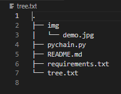
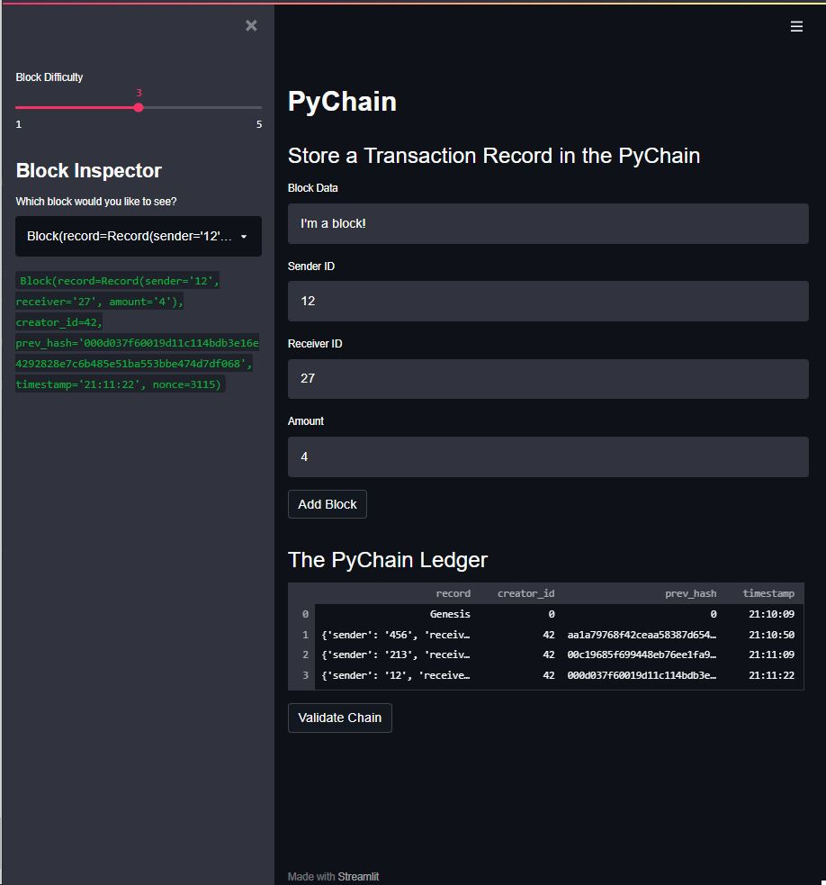

# <a id="Top-of-Page"> Welcome to the Financial Planning Tool!</a>
#### A tool for current valuation and predictive analysis of portfolio allocations.

***
## <a id="Contents">Cotents</a>
[Project Description](#Project-Description) 
[Technologies](#Technologies) 
[Installation Guide](#Installation-Guide) 
[Usage](#Usage) 
[Contributors](#Contributors) 
[License](#License) 
[Bottom of Page](#Bottom-of-Page) 

***
## <a id="Project-Description">Project Description</a>
This project creates a decentralized blockchain ledger for the tracking financial transactions.

#### A summary of what's under the hood:    
To create the blockchain, this project utilizes three <a href="https://docs.python.org/3/library/dataclasses.html" title="docs.python.org - dataclasses" target="_blank">dataclasses</a>: 
 1. <code>Record</code>
 2. <code>Block</code>
 3. <code>PyChain</code> 

The <code>Record</code> class stores the identification for the sender and receiver of the transaction as well as the amount of the transaction.  
The <code>Block</code> class stores the previously mentioned <code>Record</code> instance for this block, the <code>creatory_id</code> (stores the creator of the transaction), the <code>prev_hash</code> (stores the hash of the previous block in the chain), the <code>timestamp</code> of the instantiation of this block, and the <code>nonce</code> (the count of attempts to satisfy the difficulty of the mined hash).  
The <code>PyChain</code> class stores a <code>typing.List</code> of <code>Block</code>'s and the <code>difficulty</code> requirement for the mining of a valid hash.

#### Project layout:
The layout of essentials for this project is show below.

***
## <a id="Technologies">Technologies</a>
<a href="https://docs.python.org/release/3.8.0/" title="https://docs.python.org/release/3.8.0/">

 
<a href="requirements.txt" title="requirements.txt">Requirements List</a>

***
## <a id="Installation-Guide">Installation Guide</a>
### Project Installation
To install <a href="https://github.com/jasonjgarcia24/banking-blockchain-webapp" title="https://github.com/jasonjgarcia24/banking-blockchain-webapp">banking-blockchain-webapp</a>, type <code>git clone https://github.com/jasonjgarcia24/banking-blockchain-webapp.git</code> into bash in your prefered local directory.  
Alternatively, you can navigate to the same address (<code>https://github.com/jasonjgarcia24/banking-blockchain-webapp.git</code>) and download the full <code>main</code> branch's contents as a zip file to your prefered local directory. 

***
## <a id="Usage">Usage</a>
### Inputs
Observe banking-blockchain-webapp by typing the following in the terminal: 
 1. <code>cd &lt;path to local repo&gt;\banking-blockchain</code>
 2. <code>streamlit run pychain.py</code> 
 
No input variables are required if the default assets are used. 

### Outputs
This tool provides a web app interface for creating and tracking transactions at a range of difficulties. 
 

***
## <a id="Contributors">Contributors</a>
Currently just me :) 

***
## <a id="License">License</a>
Each file included in this repository is licensed under the <a href="https://github.com/jasonjgarcia24/banking-blockchain-webapp/blob/2e5b90ac73e067625cbdb824d78f6189eb126ca1/LICENSE" title="https://github.com/jasonjgarcia24/banking-blockchain-webapp/blob/2e5b90ac73e067625cbdb824d78f6189eb126ca1/LICENSE">MIT License.</a>

***
[Top of Page](#Top-of-Page) 
[Contents](#Contents) 
[Project Description](#Project-Description) 
[Technologies](#Technologies) 
[Installation Guide](#Installation-Guide) 
[Usage](#Usage) 
[Contributors](#Contributors) 
[License](#License) 

